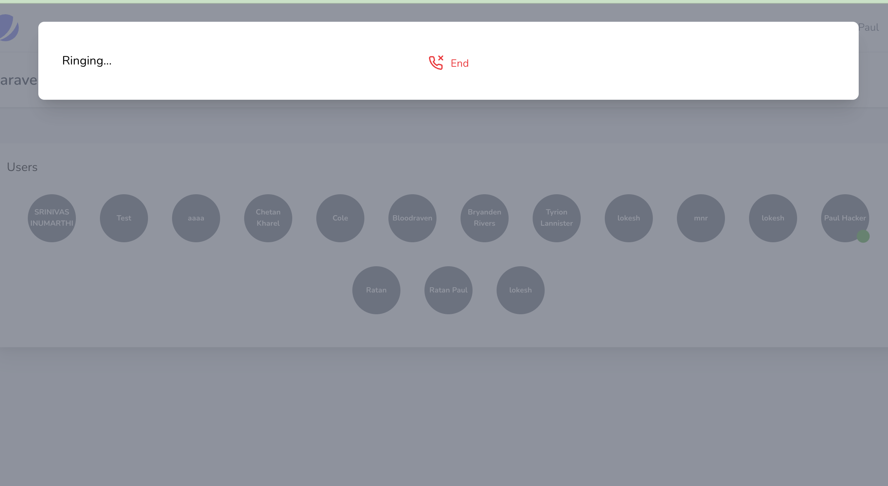
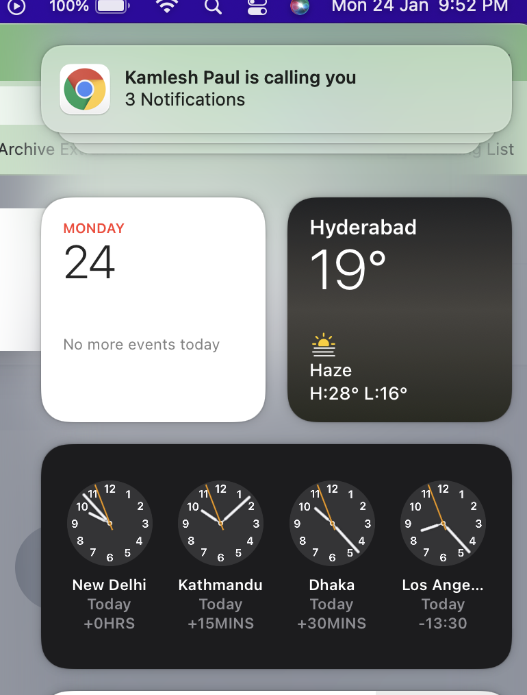
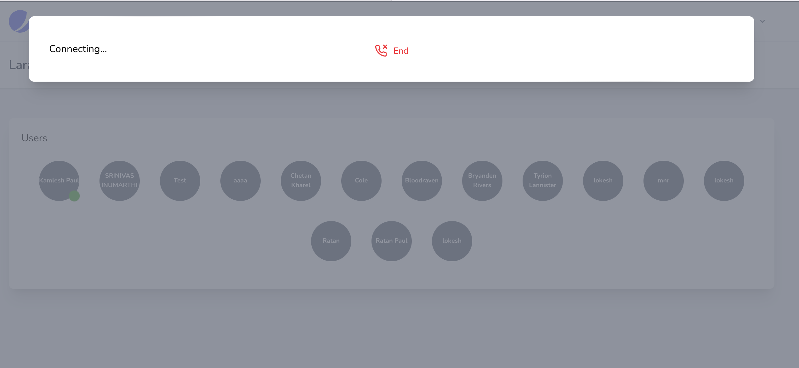
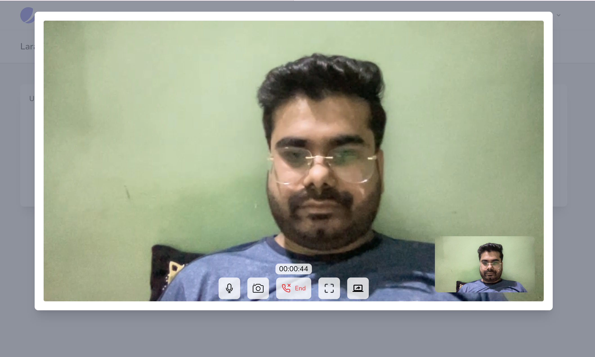

# Laravel one to one Video calling 

This is a one to one video calling app with `Laravel` and `vuejs` using `websocket` and `WebRTC` technology 

## Prerequisites

- [x] php 8.0 or above
- [x] MYSQL 8.0
- [x] COMPOSER
- [x] Node.js 12.22.0 or above

## How run the application

- copy `.env.local.example` to `.env.local` file with correct data
- Install dependencies

```bash
composer install
```

- run local development server

```bash
php artisan serve
```
>NOTE:- Run this way as video and audio supported on `https` or `localhost` don't use any test url 

- run websocket server

```bash
php artisan websocket:serve
```

Open [http://localhost:8000](http://localhost:8000) with your browser to see the result.


# Screen shots

#### Register

#### Login

#### Main Dashboard 


#### Calling


#### Notification Recivied to other user


#### Call Recivied to other user


#### Connecting to other peer stream


#### Both user connected


